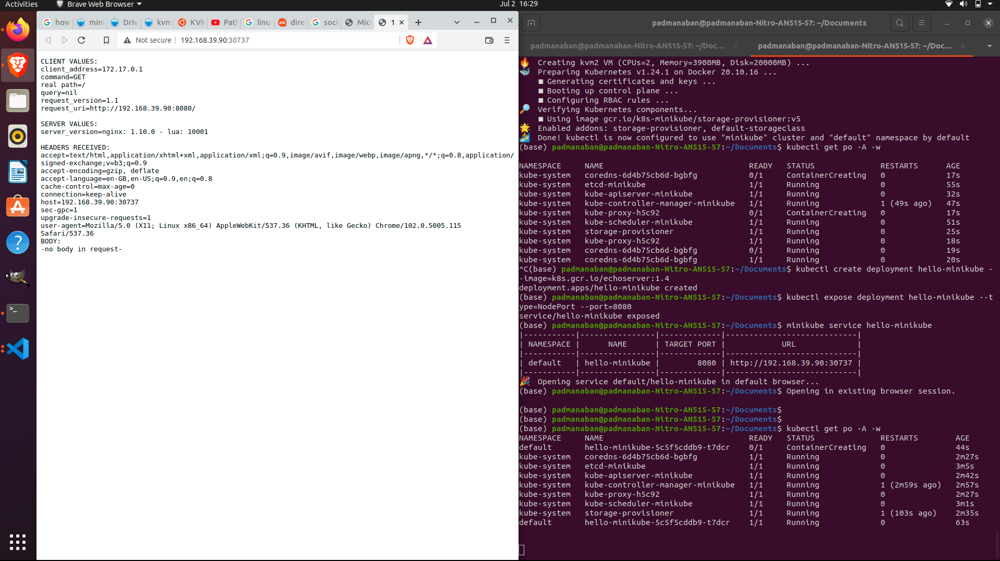

# Setting up Minikube (Ubuntu only)

## Installing latest stable binary 


Follow the steps from https://minikube.sigs.k8s.io/docs/start/ 
here i have noted down the steps that have worked for me

```
curl -LO https://storage.googleapis.com/minikube/releases/latest/minikube-linux-amd64
sudo install minikube-linux-amd64 /usr/local/bin/minikube
```

## Install Drivers 

Default Docker Driver gave error for me 

so i switched to `Linux KVM (Kernel-based Virtual Machine) driver`

I followed the steps here https://minikube.sigs.k8s.io/docs/drivers/kvm2/ to install kvm2 driver 

for ubuntu based we have to follow this link too https://help.ubuntu.com/community/KVM/Installation

**Install required packages for kvm2 driver in ubuntu**

```
sudo apt-get install qemu-kvm libvirt-daemon-system libvirt-clients bridge-utils

sudo adduser `id -un` libvirt

sudo adduser `id -un` kvm

virsh list --all

sudo chmod -R 777 /var/run/libvirt/

```

## Starting Minikube 

Since we have installed `kvm2 driver` we have to start specifying the driver 

```
minikube start --driver=kvm2
```

I have kubectl installed, so i can now use it to access shiny new cluster:
```
$ kubectl get po -A

NAMESPACE     NAME                               READY   STATUS              RESTARTS      AGE
kube-system   coredns-6d4b75cb6d-j4fgz           0/1     ContainerCreating   0             22s
kube-system   etcd-minikube                      1/1     Running             0             36s
kube-system   kube-apiserver-minikube            1/1     Running             0             36s
kube-system   kube-controller-manager-minikube   1/1     Running             1 (51s ago)   44s
kube-system   kube-proxy-sxjwv                   1/1     Running             0             23s
kube-system   kube-scheduler-minikube            1/1     Running             0             36s
kube-system   storage-provisioner                1/1     Running             0             26s

```
if you donot have kubectl installed do 


## Deploying hello-minikube

- create deployment for hello-minikube
```
$ kubectl create deployment hello-minikube --image=k8s.gcr.io/echoserver:1.4
deployment.apps/hello-minikube created
```
- expose hello-minikube as a `NodePort` service 
```
$ kubectl expose deployment hello-minikube --type=NodePort --port=8080
service/hello-minikube exposed
```
- Exposing Node port through minikube 
```
$ minikube service hello-minikube
|-----------|----------------|-------------|----------------------------|
| NAMESPACE |      NAME      | TARGET PORT |            URL             |
|-----------|----------------|-------------|----------------------------|
| default   | hello-minikube |        8080 | http://192.168.39.90:30737 |
|-----------|----------------|-------------|----------------------------|
🎉  Opening service default/hello-minikube in default browser...
```

- Note: wait for some time for hello-minikube pod to come up its takes about a minute,then access the url service 



## Stop Minikube 

Pause Kubernetes without impacting deployed applications:

```
minikube pause
```
Unpause a paused instance:

```
minikube unpause
```
Halt the cluster:

```
minikube stop
```
Increase the default memory limit (requires a restart):

```
minikube config set memory 16384
```
Browse the catalog of easily installed Kubernetes services:

```
minikube addons list
```
Create a second cluster running an older Kubernetes release:

```
minikube start -p aged --kubernetes-version=v1.16.1
```
Delete all of the minikube clusters:

```
minikube delete --all
```